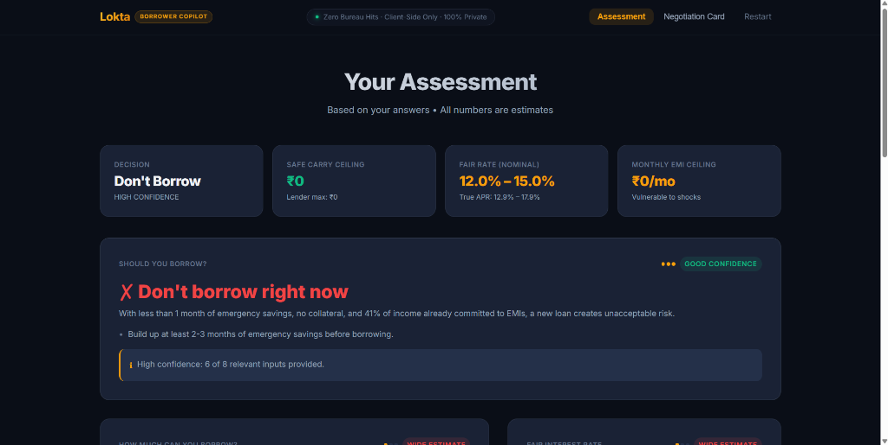
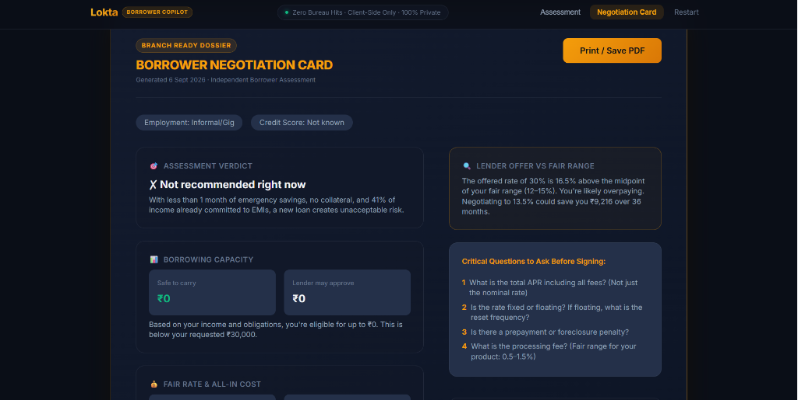
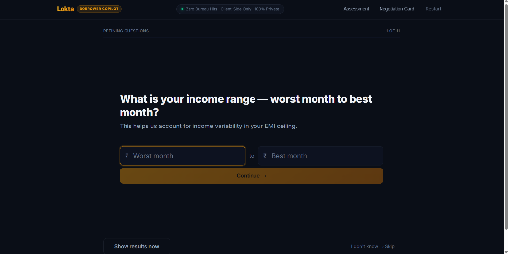
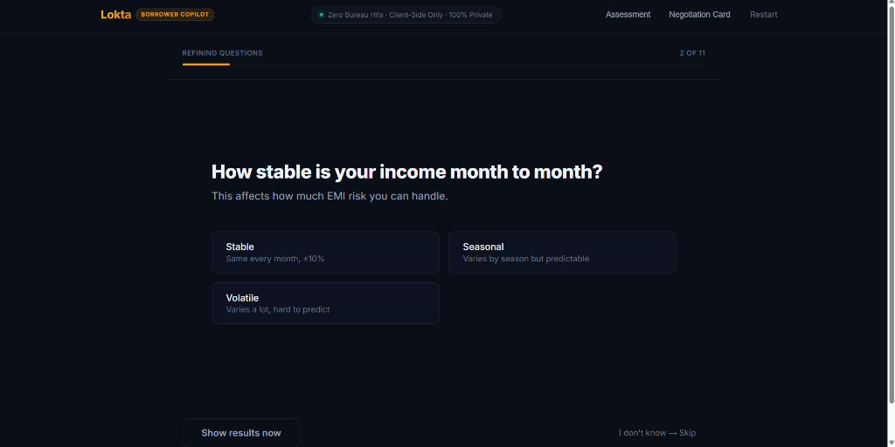

# Run-Through: Anita Devi

**Profile**: 35, Informal Cash Earner (Gig Delivery + Home Tailoring), Hubballi  
**Goal**: ₹30,000 Emergency / Medical Loan  

---

## 1. Questions Asked & Answers Given

### Must Questions (Tier 1)
| # | Question | Answer Given | Engine Implication |
|---|---|---|---|
| 1 | What do you need the loan for? | **Medical / Emergency** | Maps to Personal / Emergency Loan product |
| 2 | How much loan amount are you looking for? | **₹30,000** | Sets requested principal |
| 3 | What is your employment type? | **Informal / Gig** | Lenders heavily discount informal income (50% factor) |
| 4 | What is your monthly cash income? | **₹28,000** (range ₹26,000 – ₹30,000) | Actual cash base for living; lender recognizes ₹14,000/mo |
| 5 | What is your total monthly existing EMI outflow? | **₹11,500** | Existing app debts; consumes 41% of net income (82% of lender income) |
| 6 | What are your monthly household expenses? | **₹15,00,0** | Household expenses (food, utilities, rent, family upkeep) |
| 7 | What is your age? | **35** | Well within product tenure limits |
| 8 | What is your credit score? | **Don't know / Unknown** | Unverified credit score maps to wider benchmark band |

### Additional Questions (Tier 2)
| # | Question | Answer Given | Engine Implication |
|---|---|---|---|
| 9 | What is your income range — worst to best month? | **₹26,000 to ₹30,000** | Captures monthly income variance for stress-testing |
| 10 | How stable is your income month to month? | **Seasonal / Volatile** | Triggers higher buffer requirement |
| 11 | How many months of expenses do you have in savings? | **0 months** | Red-flag trigger: no financial safety cushion |
| 12 | Have you already received a loan offer from a lender? | **Yes** | Triggers lender rate gouging comparison |
| 13 | What interest rate were you offered? | **30.0%** | Predatory loan app offer (+16.5% above fair band) |
| 14 | What is the interest rate on existing high-cost loans? | **36.0%** | Extreme high-cost debt trap on ₹25,000 balance |

---

## 2. Four Outputs Produced

### O1: Verdict
- **Decision**: **`Don't Borrow` (High Confidence)**
- **Heading**: **`✗ Don't borrow right now`**
- **Reason**: *"With less than 1 month of emergency savings, no collateral, and 41% of income already committed to EMIs, a new loan creates unacceptable risk."*
- **Supporting Recommendation**:
  - *"Build up at least 2-3 months of emergency savings before borrowing."*
  - Prioritize clearing or restructuring existing ₹11,500/mo app loan obligations.
  - High confidence rating with 6 of 8 relevant inputs provided.

### O2: Maximum Amount
- **Lender Likely Sanction**: **₹0** (41% existing FOIR on discounted informal income leaves zero lender capacity)
- **Borrower Safe Carry**: **₹0** (With ₹11,500 existing EMIs + ₹15,000 essential expenses, monthly surplus is only ₹1,500)
- **Status**: Below requested ₹30,000. Under current cash-flows, taking on any additional debt will precipitate default.

### O3: Fair Interest Rate & True APR
- **Fair Quoted Rate (Nominal)**: **12.0% – 15.0%**
- **True APR (All-in Cost)**: **12.9% – 17.9%** (incorporating standard processing fees)
- **Lender Offer Comparison**:
  - Offeree rate of **30.0%** is **+16.5% above the fair midpoint (13.5%)**.
  - Anita is being severely overcharged by digital lending apps.
  - Negotiating to fair terms (or switching to an SHG/employer advance at 13.5%) saves ₹9,216 over 36 months.

### O4: Safe EMI Ceiling & Stress Test
- **Safe EMI Ceiling**: **₹0 / month** (Classified as *Vulnerable to shocks*)
- **Stress Analysis**:
  - Net monthly income: ₹28,000
  - Existing debt outflow: -₹11,500
  - Stated household expenses: -₹15,000
  - Available cushion: ₹1,500 (completely wiped out by any routine medical or vehicle repair expense).
  - Any new EMI makes household cash-flow negative.

---

## 3. Negotiation Card

```
┌─────────────────────────────────────────────────────────────────┐
│                    BORROWER NEGOTIATION CARD                    │
│  Generated 6 Sept 2026 · Independent Borrower Assessment        │
│  Borrower: Anita Devi (Informal/Gig · Credit Score: Not known)  │
├─────────────────────────────────────────────────────────────────┤
│  ASSESSMENT VERDICT: ✗ Not recommended right now                │
│  With less than 1 month of emergency savings, no collateral,   │
│  and 41% of income already committed to EMIs, a new loan        │
│  creates unacceptable risk.                                     │
├─────────────────────────────────────────────────────────────────┤
│  BORROWING CAPACITY:                                            │
│  Safe to carry: ₹0   |   Lender may approve: ₹0                 │
│  Requested: ₹30,000  |   Eligible: ₹0                           │
├─────────────────────────────────────────────────────────────────┤
│  LENDER OFFER VS FAIR RANGE:                                    │
│  The offered rate of 30% is 16.5% above the midpoint of your    │
│  fair range (12–15%). You're likely overpaying. Negotiating to  │
│  13.5% could save you ₹9,216 over 36 months.                    │
├─────────────────────────────────────────────────────────────────┤
│  CRITICAL QUESTIONS TO ASK BEFORE SIGNING:                      │
│  1. What is the total APR including all fees? (Not just rate)   │
│  2. Is the rate fixed or floating? What is reset frequency?     │
│  3. Is there a prepayment or foreclosure penalty?               │
│  4. What is the processing fee? (Fair range: 0.5–1.5%)          │
└─────────────────────────────────────────────────────────────────┘
```

---

## 4. UI Screenshots

### 1. Results Dashboard — Verdict & Safe Carry Ceiling
Anita's financial assessment produces a clear **"Don't borrow right now"** verdict due to zero emergency savings and 41% existing EMI obligations. Her safe carry ceiling is correctly calculated as ₹0.



---

### 2. Borrower Negotiation Card — Branch Dossier & First-Aid Plan
The one-page branch dossier highlighting the predatory 30% lender offer (+16.5% above fair range) and four critical questions to ask before signing.



---

### 3. Questionnaire Flow — Income Range Capture
Refining questions capturing worst-to-best monthly cash flow variations to stress-test irregular income.



---

### 4. Questionnaire Flow — Income Stability
Capturing income predictability (Stable, Seasonal, Volatile) to dynamically calibrate emergency buffer requirements.


