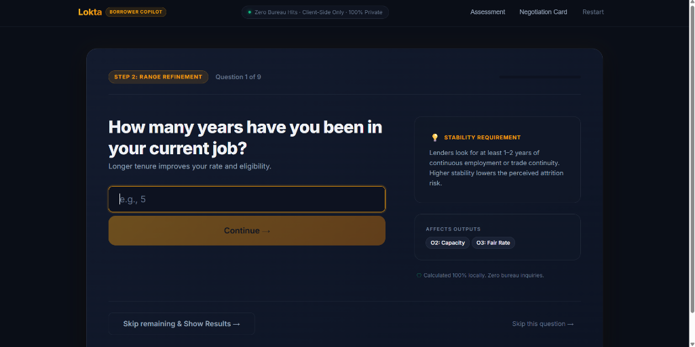
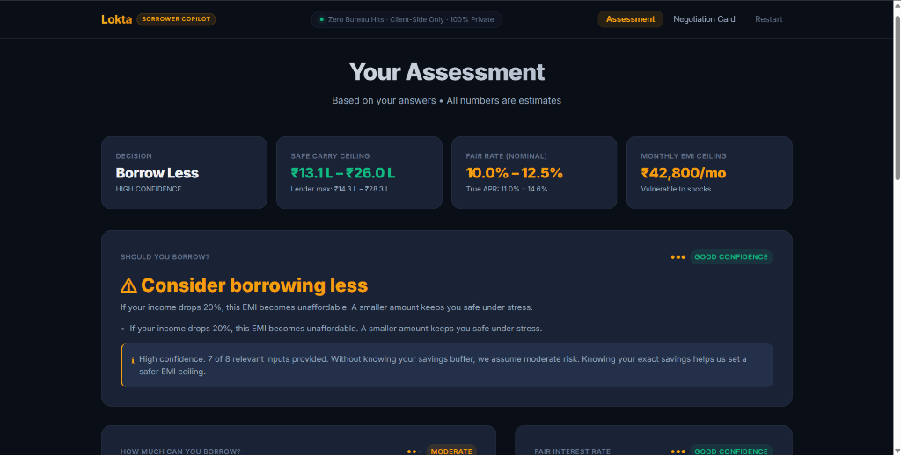
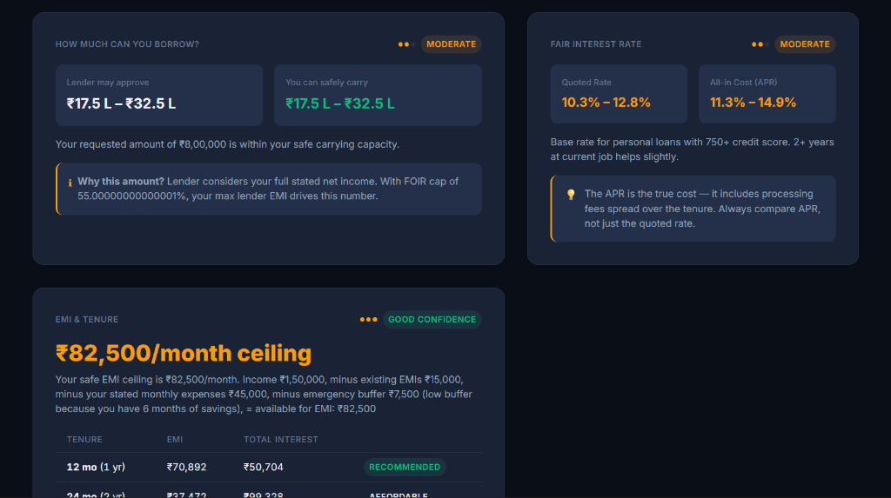
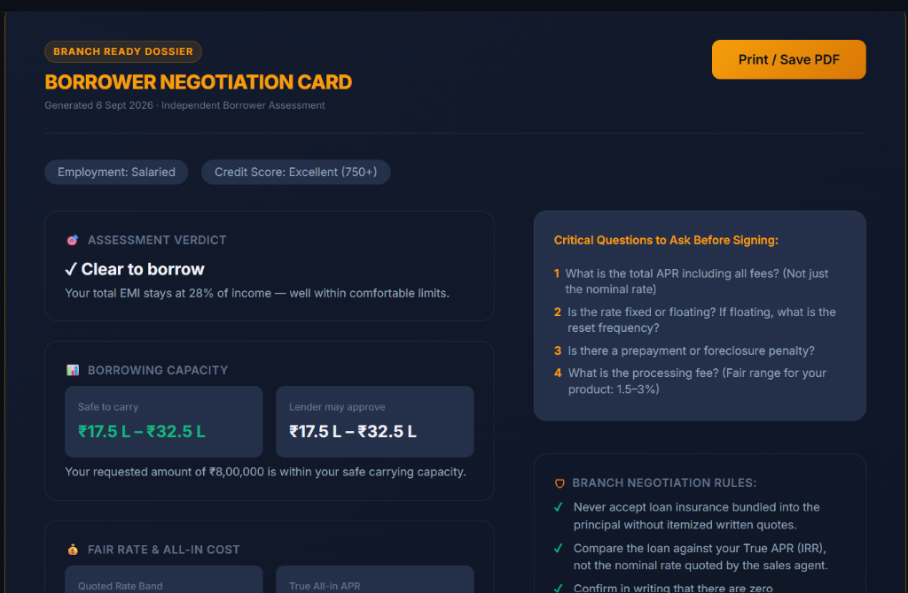

# Run-Through: Priya Sharma

**Profile**: 29, Salaried Tech Professional, Bengaluru  
**Goal**: ₹8,00,000 Loan (Home Renovation / Personal Loan)  

---

## 1. Questions Asked & Answers Given

### Must Questions (Tier 1)
| # | Question | Answer Given | Engine Implication |
|---|---|---|---|
| 1 | What do you need the loan for? | **Home Renovation / Personal** | Maps to Personal Loan product |
| 2 | How much loan amount are you looking for? | **₹8,00,000** | Sets requested principal |
| 3 | What is your employment type? | **Salaried** | Full income recognized (1.0 factor) |
| 4 | What is your monthly take-home salary? | **₹1,50,000** | Baseline for FOIR calculation |
| 5 | What is your total monthly existing EMI outflow? | **₹15,000** | Low 10% baseline FOIR obligation |
| 6 | What are your monthly household expenses? | **₹45,000** | Stated monthly living costs |
| 7 | What is your age? | **29** | Max tenure available up to retirement |
| 8 | What is your credit score? | **760+ (Excellent 750+)** | Prime tier (750+), unlocks lowest base rate band |

### Additional Questions (Tier 2)
| # | Question | Answer Given | Engine Implication |
|---|---|---|---|
| 9 | How many years have you been in your current job? | **4 years (2+ years)** | Tenure stability benefit (-50 bps rate discount) |
| 10 | How many months of expenses do you have in savings? | **6 months** | Strong emergency savings, reduces emergency buffer to 5% |
| 11 | Have you had any EMI bounces in the last 12 months? | **No (0 bounces)** | Clean repayment track record, zero bounce penalty |

---

## 2. Four Outputs Produced

### O1: Verdict
- **Decision**: **`Borrow` (High Confidence)**
- **Heading**: **`✓ Go ahead and borrow` / `✓ Clear to borrow`**
- **Reason**: *"Your total EMI stays at 28% of income — well within comfortable limits."*
- **Supporting Reasons**:
  - *"Your total EMI stays at 28% of income — well within comfortable limits."*
  - *"You have 6 months of emergency savings as a buffer."*
  - *"Even if your income drops 20%, this EMI remains affordable."*
- **Confidence**: High confidence: 7 of 8 relevant inputs provided.

### O2: Maximum Amount
- **Lender Likely Sanction**: **₹17.5 L – ₹32.5 L** (With FOIR cap of 55%, lender considers full stated net income)
- **Borrower Safe Carry**: **₹17.5 L – ₹32.5 L**
- **Recommendation**: Your requested amount of **₹8,00,000** is well within your safe carrying capacity.

### O3: Fair Interest Rate & True APR
- **Quoted Rate Band (Nominal)**: **10.3% – 12.8%**
- **True APR (All-in Cost)**: **11.3% – 14.9%** (incorporates 1.0%–2.0% processing fee spread over tenure)
- **Rate Explanation**: Base rate for personal loans with 750+ credit score. 2+ years at current job helps slightly.
- **Guidance**: APR is the true cost — always compare APR, not just the quoted rate.

### O4: Safe EMI Ceiling & Stress Test
- **Safe EMI Ceiling**: **₹82,500 / month** (Good Confidence)
- **Calculation Breakdown**:
  - Net monthly income: ₹1,50,000
  - Minus existing EMIs: -₹15,000
  - Minus stated monthly expenses: -₹45,000
  - Minus emergency buffer: -₹7,500 (low 5% buffer because she holds 6 months of savings)
  - **Available for EMI: ₹82,500 / month**
- **Tenure Trade-Off Options**:
  - **12 months (1 yr)**: EMI **₹70,892**, Total Interest ₹50,704 — **Recommended** (fastest debt elimination well within ₹82.5k ceiling)
  - **24 months (2 yr)**: EMI **₹37,172**, Total Interest ₹99,228 — **Affordable**

---

## 3. Negotiation Card

```
┌─────────────────────────────────────────────────────────────────┐
│                    BORROWER NEGOTIATION CARD                    │
│  Generated 6 Sept 2026 · Independent Borrower Assessment        │
│  Borrower: Priya Sharma (Salaried · Credit Score: Excellent)    │
├─────────────────────────────────────────────────────────────────┤
│  ASSESSMENT VERDICT: ✓ Clear to borrow                          │
│  Your total EMI stays at 28% of income — well within            │
│  comfortable limits.                                            │
├─────────────────────────────────────────────────────────────────┤
│  BORROWING CAPACITY:                                            │
│  Safe to carry: ₹17.5 L – ₹32.5 L                               │
│  Lender may approve: ₹17.5 L – ₹32.5 L                          │
│  Your requested amount of ₹8,00,000 is within capacity.         │
├─────────────────────────────────────────────────────────────────┤
│  FAIR RATE & ALL-IN COST:                                       │
│  Quoted Rate Band: 10.3% – 12.8%                                │
│  True All-in APR: 11.3% – 14.9%                                 │
├─────────────────────────────────────────────────────────────────┤
│  CRITICAL QUESTIONS TO ASK BEFORE SIGNING:                      │
│  1. What is the total APR including all fees? (Not just rate)   │
│  2. Is the rate fixed or floating? If floating, reset cycle?    │
│  3. Is there a prepayment or foreclosure penalty?               │
│  4. What is the processing fee? (Fair range: 1.5–3%)            │
├─────────────────────────────────────────────────────────────────┤
│  BRANCH NEGOTIATION RULES:                                      │
│  ✓ Never accept loan insurance bundled into principal.          │
│  ✓ Compare the loan against True APR (IRR), not nominal quote.  │
│  ✓ Confirm in writing that there are zero foreclosure penalties.│
└─────────────────────────────────────────────────────────────────┘
```

---

## 4. UI Screenshots

### 1. Adaptive Question Flow — Range Refinement
Interactive questionnaire showing Priya's tenure refinement question with the real-time Copilot insight panel.



---

### 2. Results Dashboard — Executive KPI Strip & Verdict
Dashboard displaying Priya's assessment verdict ("Go ahead and borrow"), Safe Carry range (₹17.5L – ₹32.5L), and rate band (10.3% – 12.8%).



---

### 3. Borrowing Capacity, Fair Rate & EMI Tenure Breakdown
Detailed breakdown contrasting Lender sanction limits vs Safe Carry, Quoted Rate vs True APR, and the recommended tenure schedule under ₹82,500/mo safe ceiling.



---

### 4. Branch Negotiation Card — Executive Dossier
The one-page printable card summarizing Priya's prime salaried profile, "Clear to borrow" verdict, critical questions to ask the loan officer, and negotiation rules.


