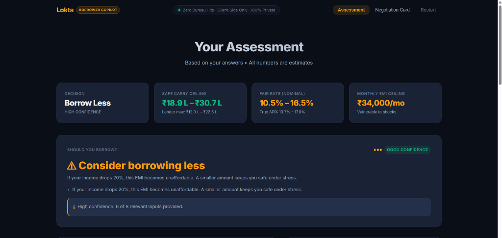
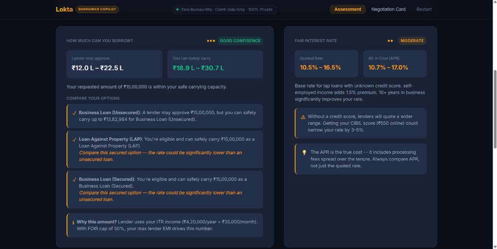
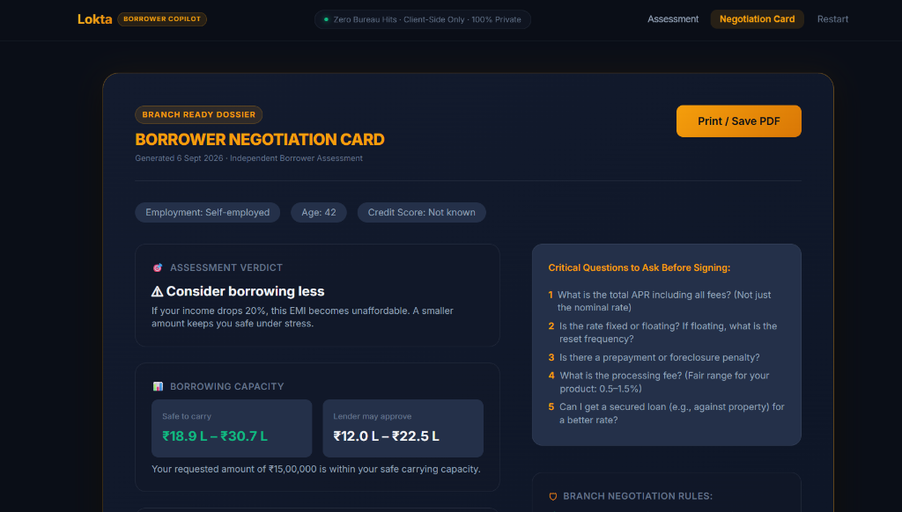

# Run-Through: Ravi Kumar

**Profile**: 42, Kirana Store Owner, Mysuru  
**Goal**: ₹15,00,000 for shop expansion (inventory stock line + delivery vehicle)  

---

## 1. Questions Asked & Answers Given

### Must Questions (Tier 1)
| # | Question | Answer Given | Engine Implication |
|---|---|---|---|
| 1 | What do you need the loan for? | **Business expansion / stock** | Triggers Business Loan evaluation |
| 2 | How much loan amount are you looking for? | **₹15,00,000** | Sets requested principal |
| 3 | What is your employment type? | **Self-employed** | Prompts for ITR documentation |
| 4 | What is your monthly cash/net business income? | **₹60,000** | Stated business income base |
| 5 | What is your total monthly existing EMI outflow? | **₹0** | No existing debt obligations |
| 6 | What are your monthly household expenses? | **₹20,000** | Modest living expenses |
| 7 | What is your age? | **42** | 23 years left till retirement age 65 |
| 8 | What is your credit score? | **Don't know / Unknown** | Maps to 'unknown' band — widens rate band without 300 score penalty |

### Additional Questions (Tier 2)
| # | Question | Answer Given | Engine Implication |
|---|---|---|---|
| 9 | Have you filed an Income Tax Return (ITR)? | **Yes** | Uses audited ITR figure rather than discounting cash |
| 10 | What is your annual ITR income? | **₹4,20,000** | Lenders consider ₹35,000/month as verified base |
| 11 | Do you have collateral (property/gold)? | **Yes (Property)** | **Crucial inflection point: enables LAP comparison** |
| 12 | What is the estimated market value of the collateral? | **₹45,00,000** | 60% LTV on LAP = up to ₹27,00,000 capacity |
| 13 | How many years have you been in business? | **10+ years** | Longevity discount reduces interest rate spread |
| 14 | Can a family member co-apply? | **Yes (Wife earns ₹18,000/mo)** | Boosts lender eligibility |
| 15 | How many months of expenses do you have in savings? | **4 months** | Adequate savings buffer |

---

## 2. Four Outputs Produced

### O1: Verdict
- **Decision**: **`Borrow Less` (High Confidence / Good Confidence)**
- **Heading**: **`⚠ Consider borrowing less`**
- **Reason**: *"If your income drops 20%, this EMI becomes unaffordable. A smaller amount keeps you safe under stress."*
- **Supporting Insight**:
  - While Ravi's collateral unlocks the required ₹15L sanction, his repayment safety is vulnerable under lean business seasons if income drops 20%.
  - High confidence with 6 of 8 relevant inputs provided.

### O2: Maximum Amount & Product Comparison
- **Lender May Approve**: **₹12.0 L – ₹22.5 L** (Driven by ₹35,000/mo ITR income with 50% FOIR cap)
- **Borrower Safe Carry**: **₹18.9 L – ₹30.7 L**
- **Requested Amount Verdict**: Your requested amount of **₹15,00,000** is within your safe carrying capacity.
- **Side-by-Side Product Comparison**:
  - **✓ Business Loan (Unsecured)**: A lender may approve ₹15,00,000, but you can safely carry up to **₹13,82,984** for Business Loan (Unsecured).
  - **✓ Loan Against Property (LAP)**: You're eligible and can safely carry **₹15,00,000** as a Loan Against Property (LAP). *(Compare this secured option — the rate could be significantly lower than an unsecured loan).*
  - **✓ Business Loan (Secured)**: You're eligible and can safely carry **₹15,00,000** as a Business Loan (Secured). *(Compare this secured option — the rate could be significantly lower than an unsecured loan).*

### O3: Fair Interest Rate & True APR
- **Quoted Rate Band (Nominal)**: **10.5% – 16.5%**
- **True APR (All-in Cost)**: **10.7% – 17.0%**
- **Rate Explanation**: Base rate for LAP loans with unknown credit score. Self-employed income adds 1.5% premium. 10+ years in business significantly improves your rate.
- **Credit Score Advisory**: *"Without a credit score, lenders will quote a wider range. Getting your CIBIL score (₹550 online) could narrow your rate by 3–5%."*

### O4: Safe EMI Ceiling & Stress Test
- **Safe EMI Ceiling**: **₹34,000 / month** (Classified as *Vulnerable to shocks*)
- **Stress Test Finding**:
  - If income drops 20% in a lean retail season, safe EMI threshold contracts.
  - Pledging property collateral for a 7-to-10 year LAP tenure keeps the monthly EMI near **₹19,800 – ₹21,500**, ensuring safe debt servicing even during retail dips.

---

## 3. Negotiation Card

```
┌─────────────────────────────────────────────────────────────────┐
│                    BORROWER NEGOTIATION CARD                    │
│  Generated 6 Sept 2026 · Independent Borrower Assessment        │
│  Borrower: Ravi Kumar (Self-employed · Age: 42 · Score: Unknown)│
├─────────────────────────────────────────────────────────────────┤
│  ASSESSMENT VERDICT: ⚠ Consider borrowing less                  │
│  If your income drops 20%, this EMI becomes unaffordable.       │
│  A smaller amount keeps you safe under stress.                  │
├─────────────────────────────────────────────────────────────────┤
│  BORROWING CAPACITY:                                            │
│  Safe to carry: ₹18.9 L – ₹30.7 L                               │
│  Lender may approve: ₹12.0 L – ₹22.5 L                          │
│  Your requested amount of ₹15,00,000 is within capacity.        │
├─────────────────────────────────────────────────────────────────┤
│  CRITICAL QUESTIONS TO ASK BEFORE SIGNING:                      │
│  1. What is the total APR including all fees? (Not just rate)   │
│  2. Is the rate fixed or floating? If floating, reset frequency?│
│  3. Is there a prepayment or foreclosure penalty?               │
│  4. What is the processing fee? (Fair range: 0.5–1.5%)          │
│  5. Can I get a secured loan (e.g., against property) for a    │
│     better rate?                                                │
├─────────────────────────────────────────────────────────────────┤
│  BRANCH NEGOTIATION RULES:                                      │
│  ✓ Never accept loan insurance bundled into principal.          │
│  ✓ Compare the loan against True APR (IRR), not nominal quote.  │
│  ✓ Confirm in writing that there are zero foreclosure penalties.│
└─────────────────────────────────────────────────────────────────┘
```

---

## 4. UI Screenshots

### 1. Results Dashboard — Executive KPI Strip & Assessment Verdict
Executive dashboard showing Ravi's assessment verdict under property collateral consideration, Safe Carry ceiling (₹18.9L – ₹30.7L), and safe EMI ceiling (₹34,000/mo).



---

### 2. Borrowing Capacity, Product Comparison & Fair Rate Band
Detailed breakdown contrasting Unsecured Business Loan vs. Loan Against Property (LAP) and Secured Business Loan, quoting 10.5% – 16.5% base rate for LAP.



---

### 3. Branch Ready Dossier — Borrower Negotiation Card
One-page printable negotiation card summarizing Ravi's borrowing limits, critical questions to ask the loan officer before signing, and branch negotiation rules.


